# DeepScan iOS – Diagrammsammlung
Gliederung:
> 1. [Use-Case-Diagramm](#1-use-case-diagramm)
> 2. [Systemkontext / Deployment](#2-systemkontext--deployment)
> 3. [Architektur-Schichten (MVVM)](#3-architektur-schichten-mvvm)
> 4. [Komponenten- & Abhängigkeitsdiagramm](#4-komponenten--abhängigkeitsdiagramm)
> 5. [Klassendiagramm](#5-klassendiagramm)
> 6. [SwiftData-Datenmodell (ER)](#6-swiftdata-datenmodell-er)
> 7. [ML-Pipeline (Datenfluss)](#7-ml-pipeline-datenfluss)
> 8. [Scan-Entscheidung (Flussdiagramm)](#8-scan-entscheidung-flussdiagramm)
> 9. [Sequenzdiagramm: End-to-End-Scan](#9-sequenzdiagramm-end-to-end-scan)
> 10. [Sequenzdiagramm: Kamera-Setup](#10-sequenzdiagramm-kamera-setup)
> 11. [Sequenzdiagramm: Tagebuch speichern](#11-sequenzdiagramm-tagebuch-speichern)
> 12. [Navigationsfluss (Screen-Map)](#12-navigationsfluss-screen-map)
> 13. [Scan-Zustandsautomat](#13-scan-zustandsautomat)
> 14. [App-Lifecycle & Dependency Injection](#14-app-lifecycle--dependency-injection)
> 15. [Koordinatensystem-Transformation](#15-koordinatensystem-transformation)
> 16. [Benchmark-Instrumentierung](#16-benchmark-instrumentierung)
> 17. [Bildspeicher-Strategie](#17-bildspeicher-strategie)
> 18. [Git-Zeitleiste (Gantt)](#18-git-zeitleiste-gantt)

---

## 1. Use-Case-Diagramm

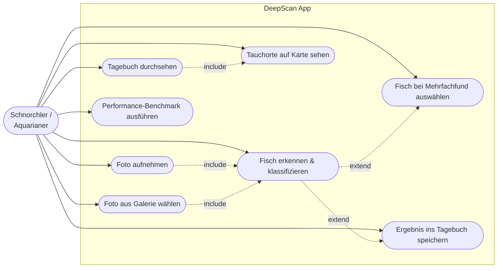

---

## 2. Systemkontext / Deployment

Zeigt, dass die App **vollständig on-device** läuft. Die einzige externe Kopplung ist
der CI-gesteuerte Modell-Sync aus dem separaten `deepscan-model`-Repo zur Build-Zeit.

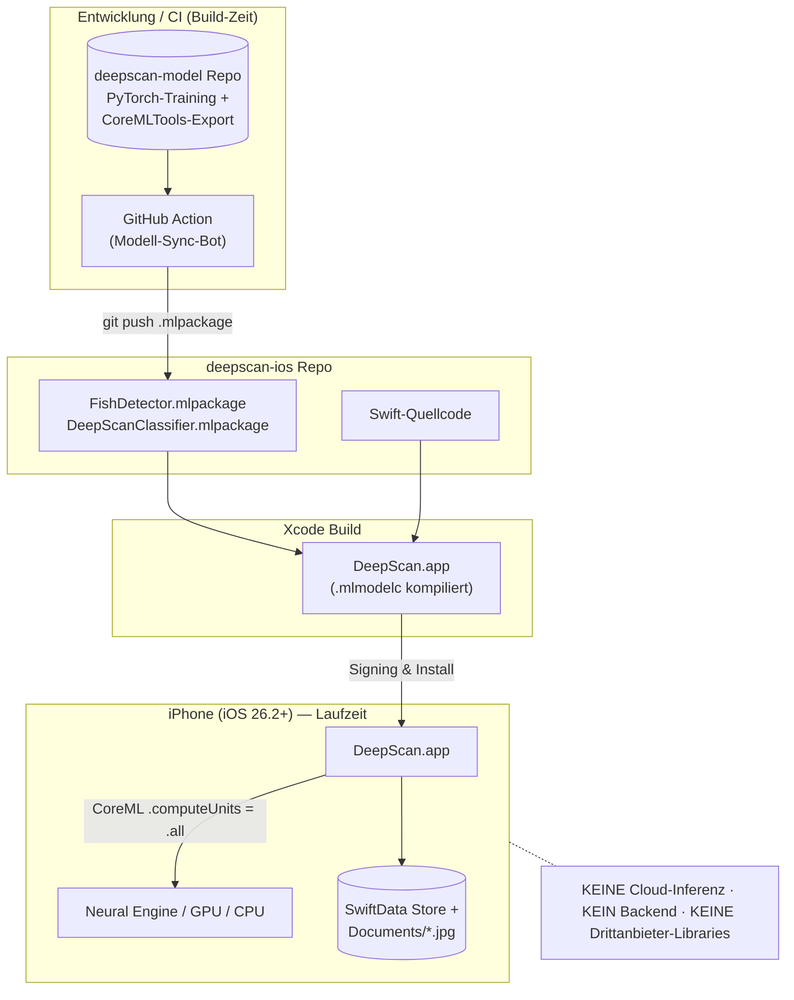

---

## 3. Architektur-Schichten (MVVM)

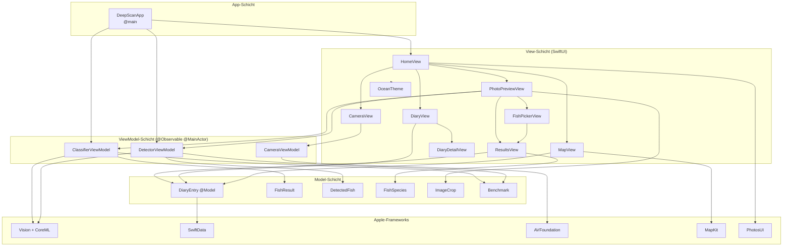

---

## 4. Komponenten- & Abhängigkeitsdiagramm

Fokus auf die Laufzeit-Abhängigkeiten der drei ViewModels und der ML-Modelle.

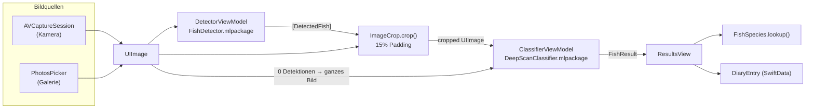

---

## 5. Klassendiagramm

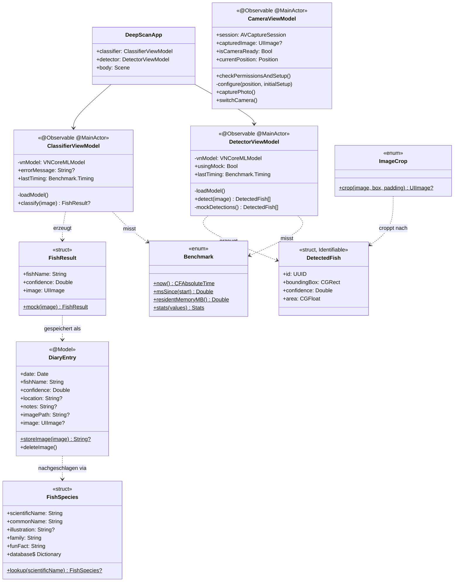

---

## 6. SwiftData-Datenmodell (ER)

Das Datenmodell ist bewusst flach (ein einziges `@Model`). Bilder liegen **nicht** in
der DB, sondern als Datei im Documents-Verzeichnis — referenziert über `imagePath`.

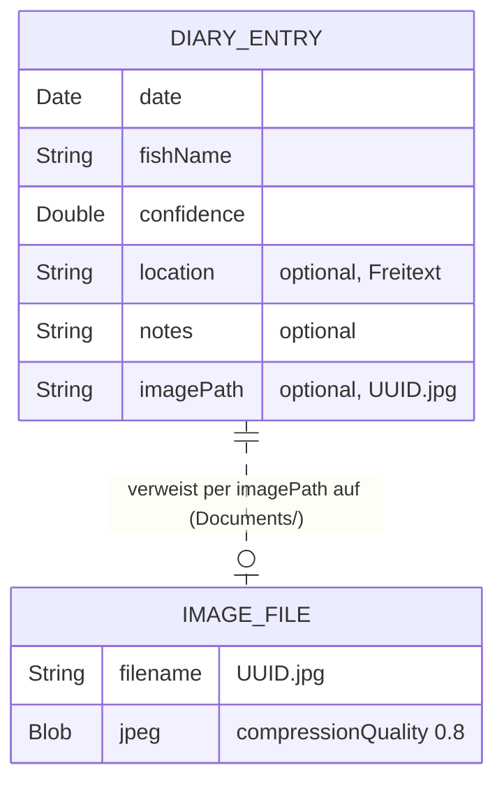

---

## 7. ML-Pipeline (Datenfluss)

Die zweistufige Inferenz — das Herzstück der App.

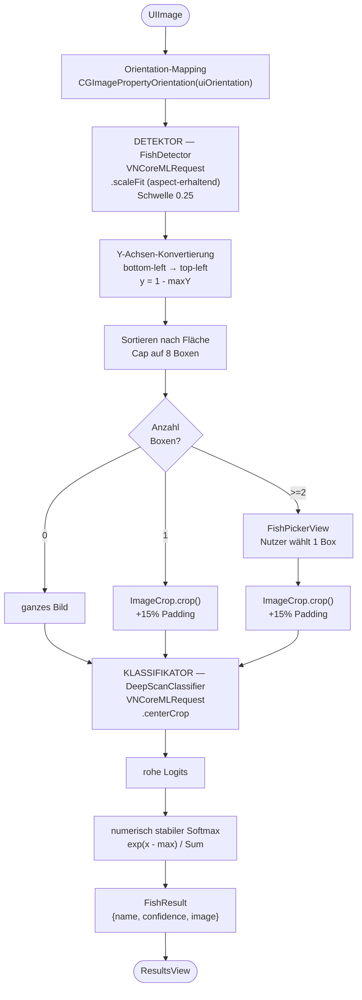

---

## 8. Scan-Entscheidung (Flussdiagramm)

Die Drei-Wege-Strategie aus `PhotoPreviewView.scan()`.

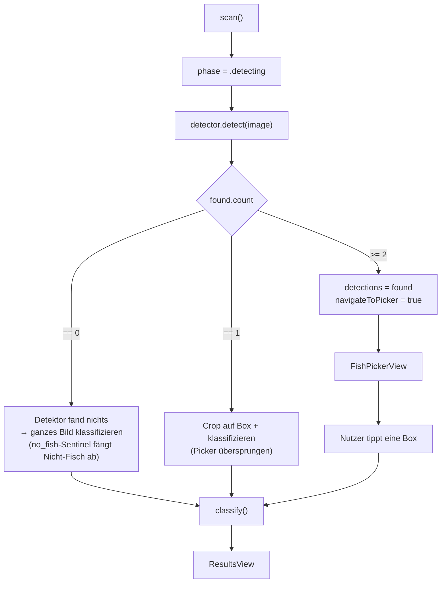

---

## 9. Sequenzdiagramm: End-to-End-Scan

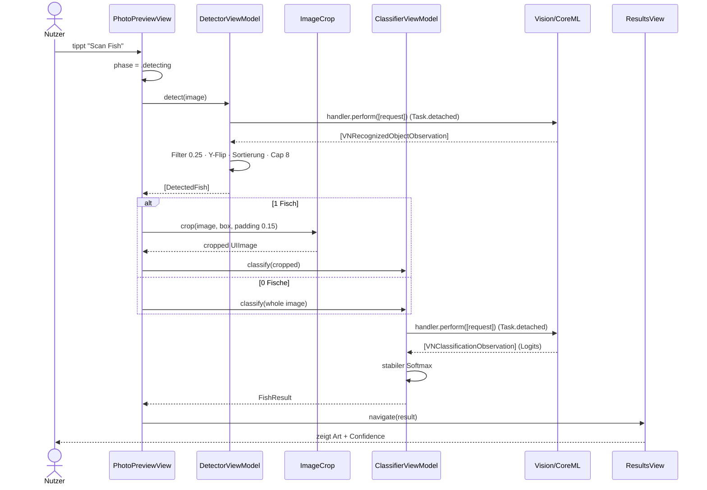

---

## 10. Sequenzdiagramm: Kamera-Setup

Zeigt den Off-Main-Thread-Workaround für `AVCaptureSession`.

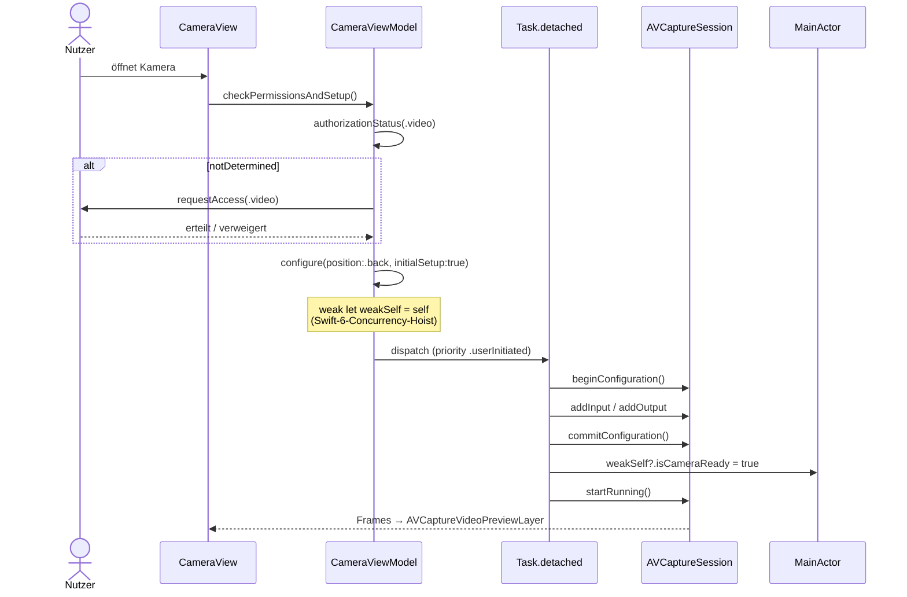

---

## 11. Sequenzdiagramm: Tagebuch speichern

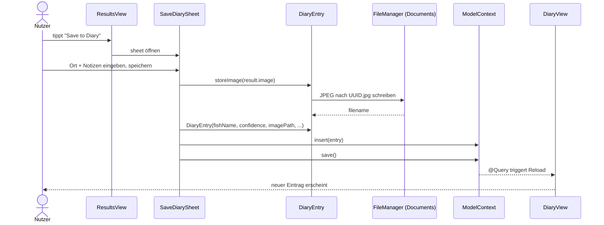

---

## 12. Navigationsfluss (Screen-Map)

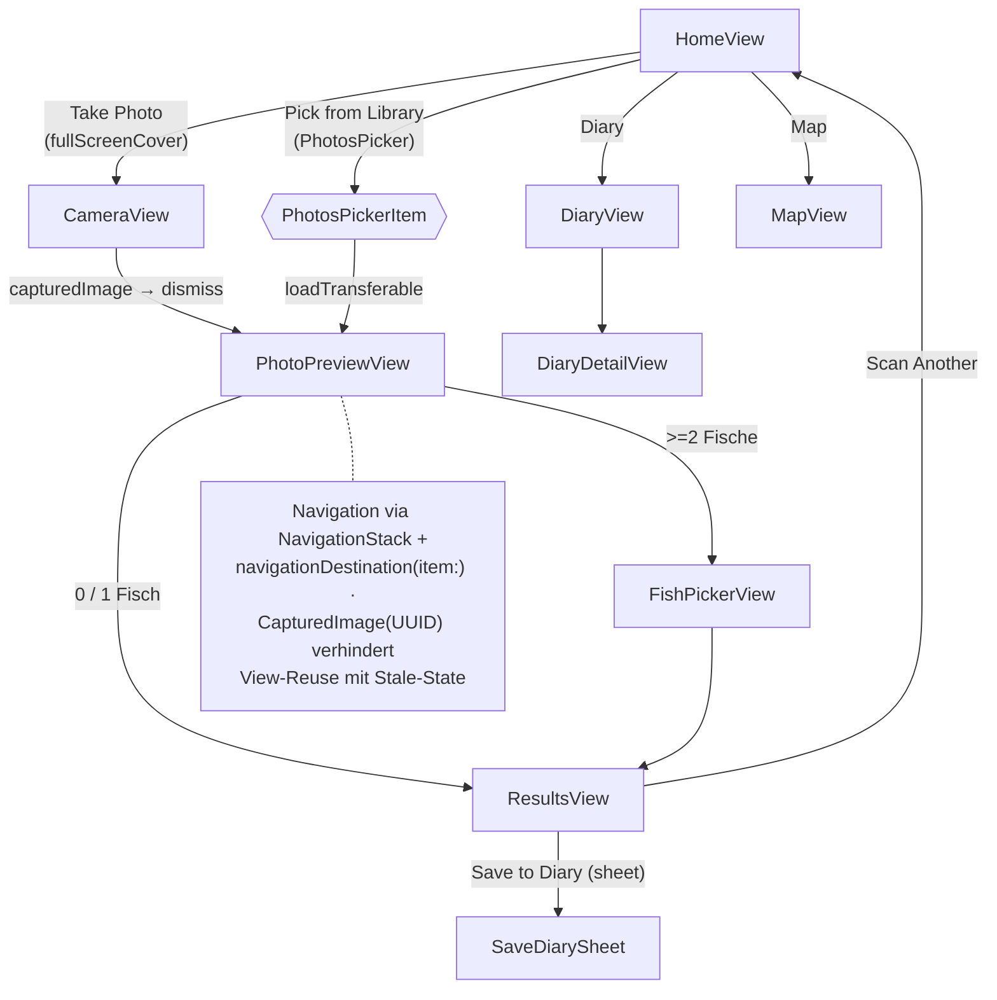

---

## 13. Scan-Zustandsautomat

Der `phase`-State in `PhotoPreviewView`.

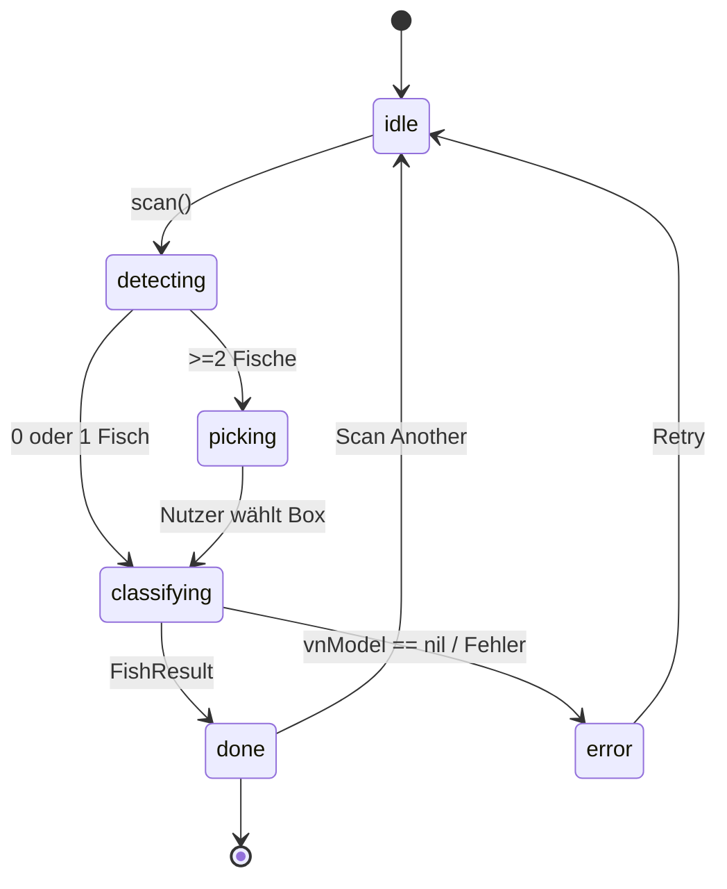

---

## 14. App-Lifecycle & Dependency Injection

Die ML-ViewModels werden **einmalig** beim App-Start erzeugt und via `@Environment`
durch den View-Tree gereicht (kein Singleton, keine Neuladung pro Scan).

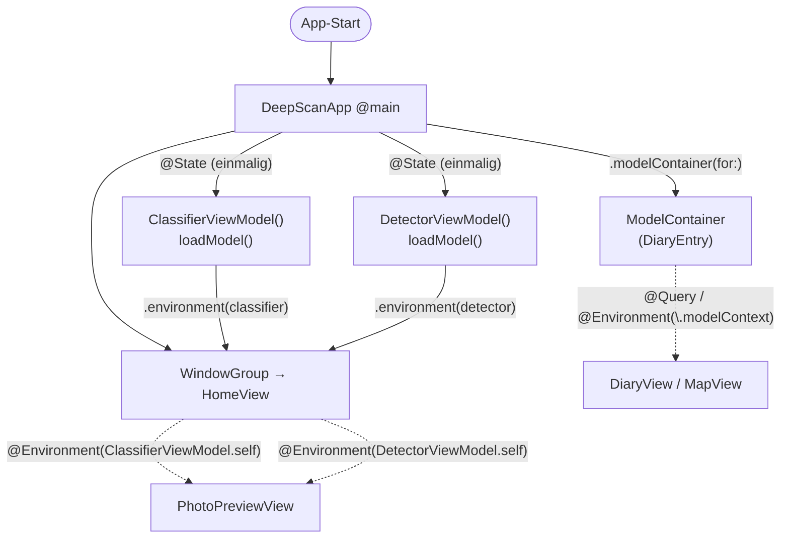

---

## 15. Koordinatensystem-Transformation

Vision liefert Bounding-Boxes im *bottom-left*-System; SwiftUI/UIImage nutzen
*top-left*. Zusätzlich muss bei `scaledToFit()`-Letterboxing umgerechnet werden.

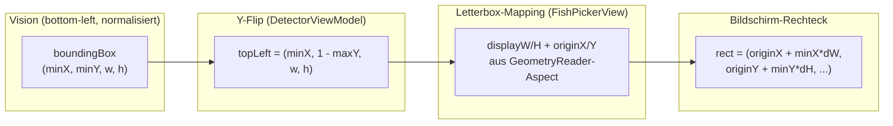

---

## 16. Benchmark-Instrumentierung

Wie die 11 CSV-Spalten für Kapitel 6.3.1 / 6.3.2 entstehen.

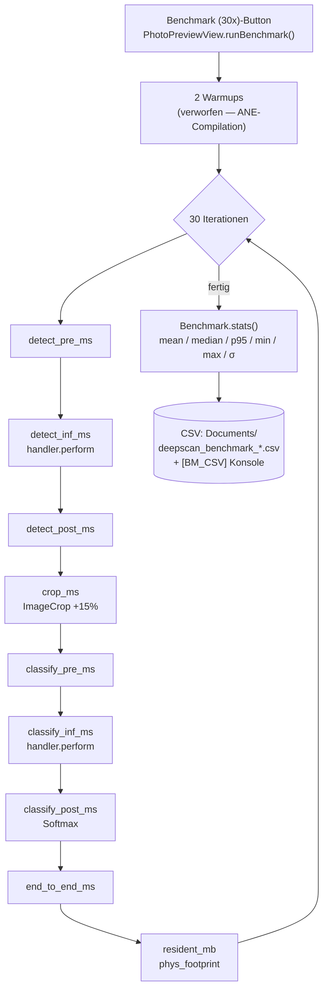

---

## 17. Bildspeicher-Strategie

Warum Bilder als Datei und nicht als `Data` in SwiftData liegen.

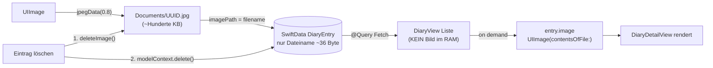

---

## 18. Git-Zeitleiste (Gantt)

Die drei Entwicklungsphasen des Projekts.

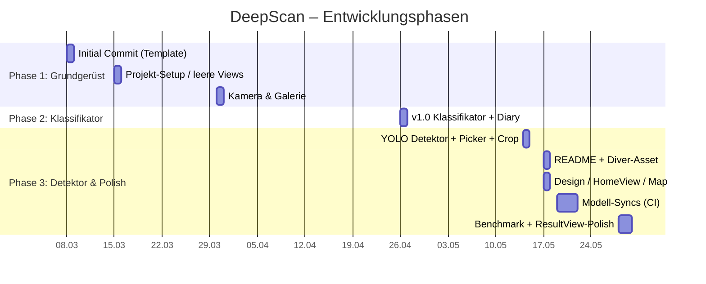

---

## Export-Hinweise für die Arbeit

- **PNG/SVG-Export:** Diagramm-Code auf <https://mermaid.live> einfügen → *Actions → PNG/SVG*.
  SVG ist vektorbasiert und skaliert verlustfrei für den Druck.
- **Hohe Auflösung:** auf mermaid.live unter *Configuration* `"scale": 3` setzen.
- **Konsistenter Stil:** Für ein einheitliches Theme oben in jeden Block
  `%%{init: {'theme':'neutral'}}%%` einfügen (Graustufen, gut für Schwarzweißdruck).
- **LaTeX/Word:** SVG einbetten oder PNG mit ≥300 dpi platzieren.
- **Alternative:** Die Diagramme lassen sich 1:1 nach PlantUML übersetzen, falls dein
  Lehrstuhl ein bestimmtes Werkzeug verlangt — sag Bescheid, dann liefere ich die Varianten.
```
